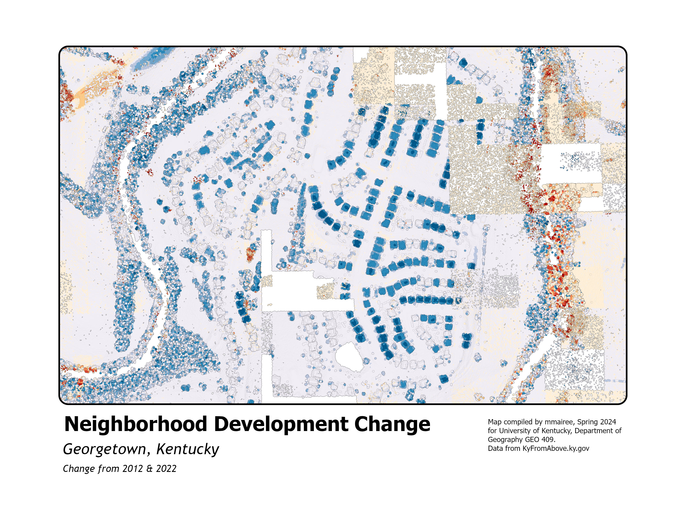

# Neighborhood Development Change Overtime from 2012 - 2022
## Georgetown, Kentucky

In this neighborhood area of Georgetown, much change has happened. Georgetown has been a city experiencing a lot of population growth. More population = more housing. In this map, you can see that many homes have been built in this area since 2012 to accomodate more families and people to live in this city.

     
*Neighborhood Development Change*

[Link to high-resolution version](Layout.pdf)     

The author of this map was by Maire Birdwell. Sources come from data from KyFromAbove.ky.gov. 